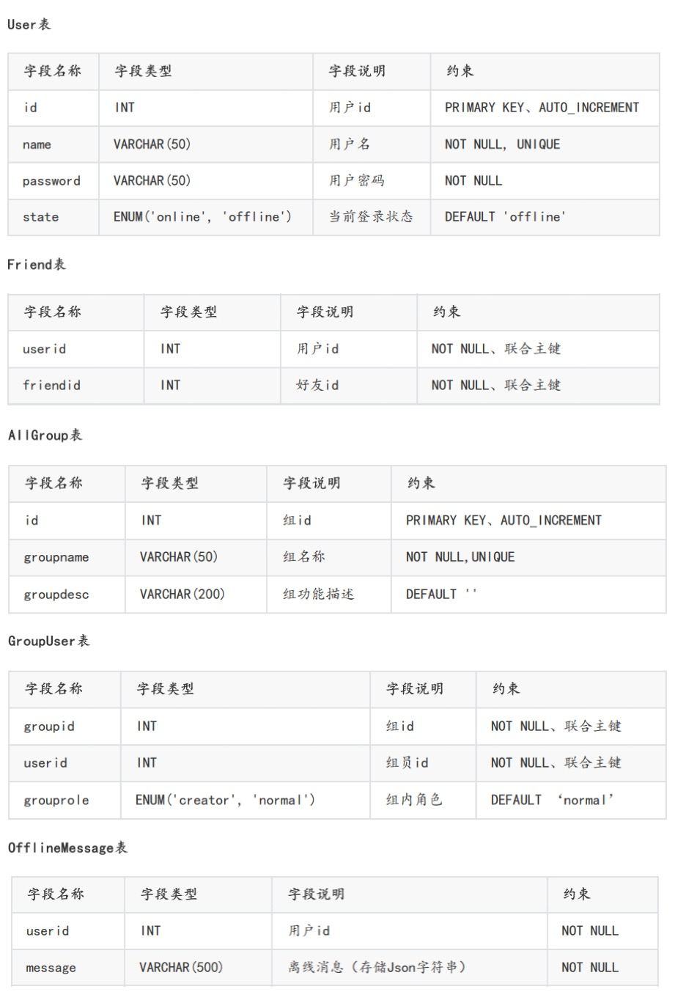

# Cluster-Chat-Server
在 Linux 环境下基于 muduo 开发的集群聊天服务器

------------------------------------
## 项目需求
>* 客户端新用户注册
>* 客户端用户登录
>* 添加好友和添加群组
>* 好友聊天
>* 群组聊天
>* 离线消息
>* nginx配置tcp负载均衡
>* 集群聊天系统支持客户端跨服务器通信

## 技术栈
>* Json序列化和反序列化
>* muduo网络库开发
>* nginx源码编译安装和环境部署
>* nginx的tcp负载均衡器配置
>* redis缓存服务器编程实践
>* 基于发布-订阅的服务器中间件redis消息队列编程实践
>* MySQL数据库编程
>* CMake构建编译环境

## 开发环境
>* ubuntu linux环境
>* Json开发库
>* boost + muduo网络库开发环境
>* redis环境
>* mysql数据库环境
>* nginx
>* CMake环境

## 数据库设计


## 运行
```
cd Cluster-Chat-Server
cmake
cd bin
./ChatServer
./ChatClient 127.0.0.1 6000
```

## nginx负载均衡配置
```
# nginx tcp loadbalance config
# 注意，下方 stream 和 http 同一级别，无隶属关系
stream {
    upstream MyServer {
        # weight：权重；  max_fails：心跳次数   fail_timeout：响应时间
        server 127.0.0.1:6000 weight=1 max_fails=3 fail_timeout=30s;
        server 127.0.0.1:6002 weight=1 max_fails=3 fail_timeout=30s;
    }

    server {
        proxy_connect_timeout 1s;
        # proxy_timeout 3s;
        listen 8000;
        proxy_pass MyServer;
        tcp_nodelay on;
    }
}
```